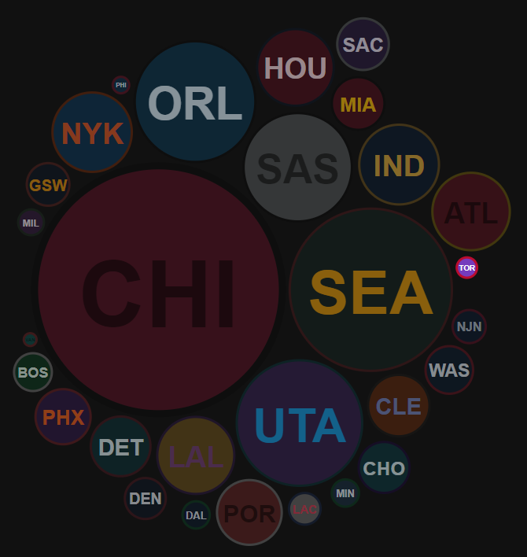
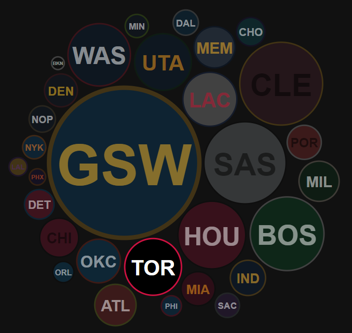
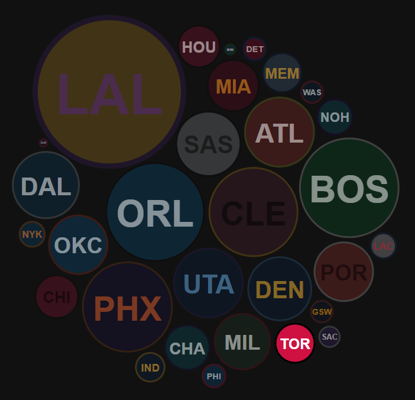
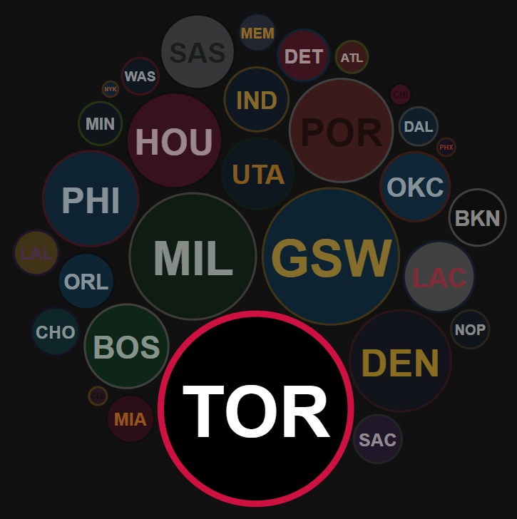

# Methodology

The season summary graphic is designed to show every NBA team's _strength_ compared to all others
for a given season. Each team is represented by a circle, with the champion team being the largest one.

_Strength_ in this case, is roughly defined as:

> _regular season win rate + playoff wins, compared to the season's champions_

For the exact calculation in the code:

```
// pWins is a ratio of playoff wins to max. possible playoff wins
// wRate is the regular season win-rate (as a value between 0 and 1)
// overallRtg is expected to be a float between 0 and 1, and is used like a percent value

let overallRtg = (wRate + wRate + pWins) / 3;

// the championship team receives a 20% overallRtg boost, to
// highlight them on the graphic

if(rec.champion) {
  overallRtg += 0.2;
}
```

This kind of comparison easily shows the competitive balance between teams in a given season. At a glance, we can see how the 1995-1996 Chicago Bulls and the 2016-2017 Golden State Warriors simply dominated the league's landscape.

## 1995-1996 NBA season



## 2016-2017 NBA season



This can be contrasted with the 2009-2010 or 2018-2019 seasons, where the Lakers and Raptors (respectively) won their championship without that level of dominance, or were just competing in a relatively balanced league.

## 2009-2010 NBA season



## 2018-2019 NBA season


